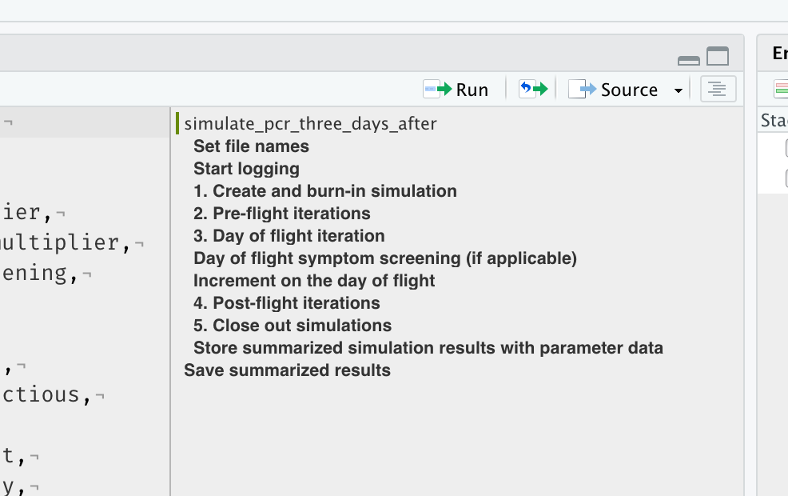

<!-- README.md is generated from README.Rmd. Please edit that file -->

```{r, include = FALSE}
knitr::opts_chunk$set(
  collapse = TRUE,
  comment = "#>"
)
```

# `projects_template`

A simple repository that shows the basic project structure used for nearly all my personal, academic, and work projects that involve code, analysis, and writing. We're constantly experimenting to see what works best so this template is a way for us to stay up to date as we start new projects. 

## Folder and file structure

Each project, defined as a single concrete deliverable (e.g., a single paper or report), is contained in a folder that has the following sub-folders: 

- **`code`**: Holds all code files. Each code file should be numbered sequentially (`01`, `02`, ...) and each file should perform a single discrete task. Also holds unnumbered dependency files such as `utils.R` and `secrets.R`. 
- **`data`**: Contains the cleaned and munged analytic data used for modeling, plotting, analyses. These data **will** be uploaded to Github unless specified in the `.gitignore`.
- **`data_private`** *(not uploaded)*: Contains raw data that should **never** be uploaded (e.g., individual-level data with personally identifiable information).
- **`data_raw`**: Contains raw data that is publicly available but not in the analytic form (e.g., US Census or ACS variables). By default, these will be uploaded but large files should be ignored via `.gitignore` and the data should be held somewhere else (e.g., OSF) or downloaded via a script in `code`.
- **`lit`** *(not uploaded)*: Relevant and important articles for this project that all team members should be familiar with. 
- **`manuscript`** *(not uploaded)*: Current working draft of the manuscript to be submitted. 
- **`misc`** *(not uploaded)*: Important project files that should not be uploaded such as IRB approval, grant proposals, etc. 
- **`output`**: Non-graphical output such as table output. 
- **`plots`**: Graphical output saved as both `pdf` and `jpg` for each one. Similar to `code`, files should be enumerated to the order they are presented in the manuscript with some brief description: `fig01_*.pdf`, `figS01_*.pdf`. Internal or diagnostic plots should be saved with a brief description. 
- **`rmds`**: All `rmarkdown` files should be saved here with the knitting directory set as the Project Folder. 

Along with a `.Rproj` file in the root and `README.Rmd` (with the generated `README.md`) in the root and any relevant sub-folder. 

### Using `./code/secrets.R`

Sometimes projects require the team to pass along information that should not be shared outside of the researchers (e.g., server credentials to our internal server). These variables should be stored in `./code/secrets.R` which is in the `.gitignore` file and will not be uploaded to Github. An example `secrets.R` file might look something like this:

```
census_api_key <- "DSKLJD3dsada0s8*k2us77gjhddas"
```

such that when the key is needed, the code file just calls `source("./code/secrets.R")` to bring that variable into the global environment and then uses it as normal (e.g., `acs_pull(api_token = census_api_key)`).

### Creating ignored folders

After downloading and cloning this repo, just run:
```
fs::dir_create(here::here(c("data_private", "lit", "manuscript", "misc")))
```
to quickly create the folders that are in the `.gitignore`.

### Creating more `README` files

In theory, each subfolder should have its own `README.[R]md` file containing information about the folder and its contents. In practice, this is not necessary for most papers. In instances where this may be beneficial for the team as a whole (or your future self), such as keeping track of where public data in `./data_raw` were downloaded and when they were accessed, use `README` files liberally. 


## Style guide

- Code should more or less follow the [tidyverse style guide](https://style.tidyverse.org/). 
- Clarity of code should be valued above optimized and fast code. Optimization can occur after we have tests in place, but prototyping code should always be as readable as possible. 
- Document your code excessively during prototyping. We can always clean that up as we get to a final product.
- If you have a lot of functions in a single file (e.g., `utils.R`), use the `roxygen2` documentation style so we can rapidly convert it to an R package as necessary.
- Structure your code using markdown headers and four dashes (`----`) so it is easier to skip around in [the Document Outline](https://blog.rstudio.com/2020/12/02/rstudio-v1-4-preview-little-things/):



- Except for `./misc`, file names should not contain spaces — use `_` instead. For things like `./manuscript`, use numbers to keep things in order (e.g., `00_cover_letter_*.doc`, `01_manuscript_*.doc`, `02_supplement_*.doc`) with the dates in YYYYMMDD format at the end of each file. 
- Functions should be verbs and, when possible, should be pipe-able. 

## Using Github

For personal projects, you do you. 

For collaborative projects:

- Every collaborator should have their own branch and merge with the main branch regularly.
- Use Github issues (with links to the line of code when applicable) and assign the collaborator who can most readily address your bottleneck. 
